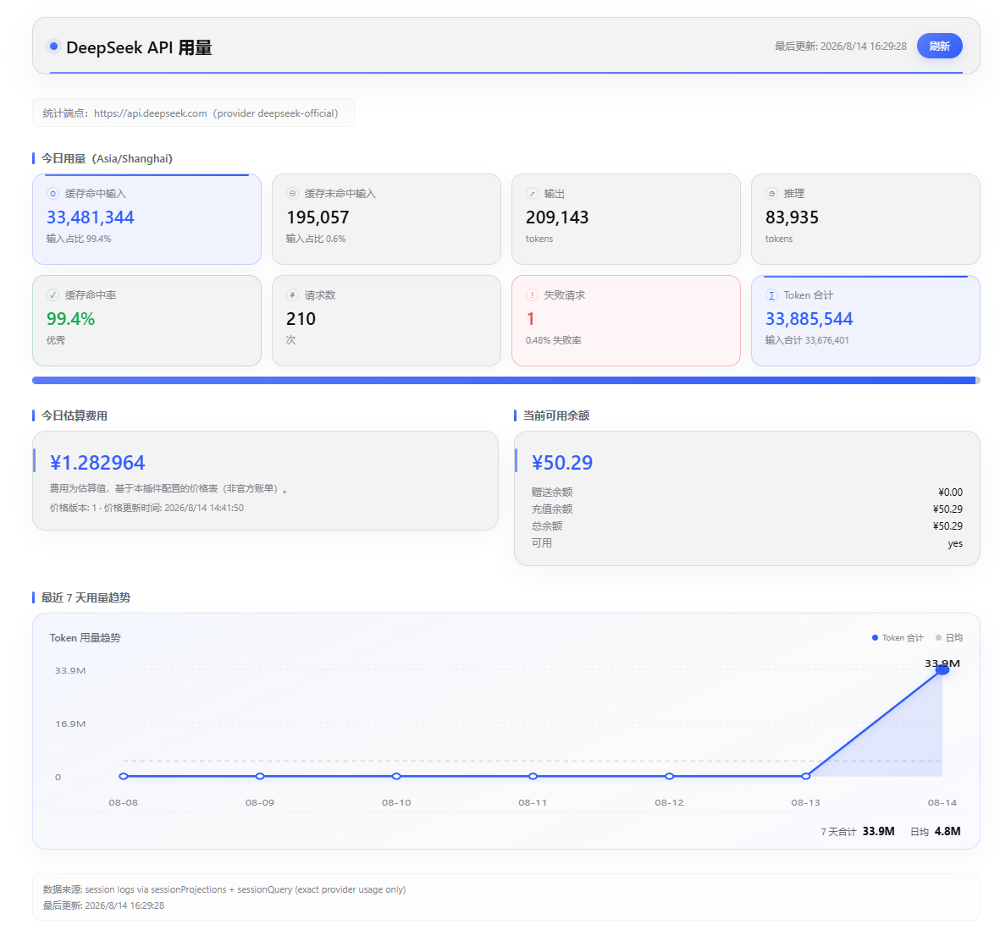

# dsh-deepseek-usage-dashboard

简体中文 | [English](./README.en.md)

一个独立、可安装的 DeepSeek Harness（DSH）Web UI 插件，用于：

- 从会话日志统计本 DSH 实例**每日 DeepSeek Token 用量**（仅精确 usage：缓存命中/未命中输入、输出、推理）；
- 基于**用户可编辑的分模型价格表**估算今日费用；
- 监控 **DeepSeek 账户余额**（仅 Host 端调用，默认每 10 分钟刷新，支持手动刷新）；
- 在 Web GUI 中以仪表盘、composer 底部统计行与设置卡片展示。

## 效果预览



仅基于官方 `@deepseek-ai/*` NPM SDK 开发；不修改任何 DSH 源码；通过 `cordis.patch.yml` + profile 插件机制安装。插件**全程不调用任何 LLM 接口**：统计、刷新、展示、余额查询零模型调用，空闲运行与刷新页面产生的 Token 为 0。

## 功能

- **每日统计（Asia/Shanghai 自然日）**：缓存命中输入、缓存未命中输入、输出、推理（存在时）、输入合计、Token 合计、请求数、失败请求数、缓存命中率。
- **只统计真实的 DeepSeek 流量**：provider 路由为 `deepseek-official`（可配置）**且**有效 base URL 主机为 `api.deepseek.com`——自定义网关不会污染统计。
- **流式安全**：只有最终 usage 到达才落库；流式估算值从不写入每日精确统计。
- **幂等 + 持久化**：SQLite（Node 24 运行时内置 `node:sqlite`），`UNIQUE (session_id, turn, step)` 约束 + `INSERT OR IGNORE`——投影重放、流式 usage 重复到达、重启后重扫、重复提交均不会重复累计；跨重启保留；损坏文件自动移出并重建。
- **Decimal 金额**：费用以整数最小单位（1e-6 币种单位）BigInt 累计，禁止浮点直接累计。**时间感知计价**：请求按开始时间选择生效的 PricingSchedule（`effectiveFrom <= requestTime`，含边界），支持分时段 band（如 peak/off-peak 窗口，start 含 / end 不含、可跨午夜）；历史请求不会被后来新增的价格计划重算。未知模型明确记为「未计价」（不静默套用兜底价），显式配置 `*` 兜底仍可用；界面显示价格版本、更新时间与计价来源，所有金额明确标注为「估算费用，非官方账单」。
- **余额**：仅 Host 端 `GET https://api.deepseek.com/user/balance`（base URL 固定、10 秒超时、401/402/429/5xx/超时/畸形响应分别处理）；失败时保留最后一次成功数据并显示 stale 状态；支持手动刷新。API Key 绝不进入浏览器、日志或请求参数。
- **Host HTTP 接口**：`/api/deepseek-usage/stats` 与 `/api/deepseek-usage/refresh`，复用 DSH 浏览器信任篱笆（Host / Origin / Sec-Fetch-Site 校验，按官方 api-request-trust 语义实现）+ loopback 套接字校验；余额明细仅限 loopback；POST 要求 `application/json`；限制请求体大小；不提供任意 URL/文件/命令代理。
- **Web UI**：侧边栏「API 用量」入口；仪表盘（今日卡片、缓存命中/未命中对比条、命中率、今日估算费用、余额（总额/赠送/充值）、最近 7 天趋势、最后更新时间、数据来源说明）；`conversation.composer.dock` 紧凑统计行（`今日：命中 X · 未命中 X · 输出 X · 估算 ¥X · 余额 ¥X`）；完整中英文 locale；仅使用 DSH CSS Token（适配亮/暗主题）；不使用 `dangerouslySetInnerHTML`。

## 安装

```sh
dsh plugin --profile web add https://github.com/izz-BLUE/dsh-deepseek-usage-dashboard.git
```

重启 `dsh web` 后，侧边栏出现「API 用量」入口，composer 下方出现今日统计行。

本地开发可安装仓库检出目录：

```sh
dsh plugin --profile web add link:<本仓库路径>
```

> 如需纳入 `dsh-web-ui-all` 聚合包：把本包追加到 `packages/dsh-web-ui-all/aggregate.yml`（`patchFrom` 与 `deps` 两段），再运行 `node scripts/aggregate.mjs`。

## 验证

```sh
pnpm typecheck
pnpm test
pnpm build
```

## 配置

设置命名空间 `deepseek-usage`（设置页 → 插件配置，或直接编辑 `~/.dsh/settings.yaml`）：

| 字段 | 默认值 | 说明 |
| --- | --- | --- |
| `enabled` | `true` | 总开关 |
| `providerId` | `deepseek-official` | 被统计为 DeepSeek 的 provider 路由 |
| `balanceRefreshMinutes` | `10` | 余额刷新间隔（分钟） |
| `pricingSchedules` | — | 分时段价格计划（time-aware pricing，优先于 `prices`） |
| `prices` | 见 `DEFAULT_PRICE_ENTRIES` | 旧版分模型价格表（legacy，仅在未配置 `pricingSchedules` 时生效） |

### 计价（Pricing）

- **时间感知**：每个请求按其**请求开始时间**（`step/start`）所属的 schedule 计价；`schedule.effectiveFrom <= requestTime` 生效（含边界）。价格变更只影响生效时刻之后的请求，**历史请求不会被新价格重算**。
- **分时段**：schedule 可按本地时间窗口（如 `08:00 → 18:00`，start 含 / end 不含；`end < start` 跨午夜；`start === end` 为全天）划分 band；未落入任何窗口的时间自动归入隐式 `off-peak` band。
- **未知模型 = 未计价（UNPRICED）**：内置默认表**不再提供 `*` 兜底**——未知模型明确显示为「部分用量未计价」，其 token 不进入估算金额；只有你在配置中**显式**配置 `*` 行时才启用兜底。
- **金额**：仍以整数微单位（1e-6 币种单位）BigInt 累计；SQLite 只存 token/模型/时间戳，金额一律读取时推导，配置纠错后历史重算即可。
- **币种**：同一 `pricingSchedules` 集合必须统一币种，混合币种会在配置校验时被拒绝（避免把不同币种静默加成一个 ¥ 数字）。

`pricingSchedules` 示例（价格均为示意）：

```yaml
deepseek-usage:
  pricingSchedules:
    - id: legacy-2026-04-24
      effectiveFrom: '2026-04-24T00:00:00+08:00'
      timezone: Asia/Shanghai
      currency: CNY
      windows: [{ id: all-day, start: '00:00', end: '00:00' }]
      models:
        - model: deepseek-v4-flash
          ratesByBand:
            all-day: { cacheHitInputPricePerMillion: 0.02, cacheMissInputPricePerMillion: 1, outputPricePerMillion: 2 }
```

旧版 `prices` 配置**继续原样工作**（无需手改 JSON）：它会被归一化为按 `effectiveFrom` 分组的全天 schedule（`user-legacy-*`）。旧数据中的请求时间以落库时间为近似（`request_time_ms = time_ms` 回填），新写入的数据记录真实请求开始时间。

数据保存在 `~/.dsh/deepseek-usage/usage.db`（SQLite）。API Key 通过 `@deepseek-ai/dsh-credentials` 解析 `llm-deepseek` 的凭据引用（默认 `DEEPSEEK_API_KEY`），以 Host 进程环境变量作为明确 fallback。

## 数据来源与字段映射

统计来自**会话事件日志**：官方可重放投影注册表（`ctx.sessionProjections`，与 `@linxin666/dsh-live-stats` 同一扩展点）+ 启动时经 `ctx.sessionQuery` 的补扫。官方 DeepSeek 适配器（`@deepseek-ai/dsh-llm-deepseek`）的 wire→TokenUsage 映射（`translate.mapUsage`）：

| DeepSeek wire 字段 | harness `TokenUsage` | 仪表盘桶 |
| --- | --- | --- |
| `prompt_cache_hit_tokens`（或 `prompt_tokens_details.cached_tokens`） | `cacheReadTokens` | `cacheHitInputTokens` |
| `prompt_tokens - cacheRead`（不相交；即 `prompt_cache_miss_tokens`） | `inputTokens` | `cacheMissInputTokens` |
| `completion_tokens` | `outputTokens` | `outputTokens` |
| `completion_tokens_details.reasoning_tokens` | `reasoningTokens` | `reasoningTokens` |
| （DeepSeek 不上报） | `cacheWriteTokens`（缺省） | 计 0 |

等价性由 `tests/mapping.spec.ts` 钉死。

## 安全

- API Key 只存在于 Host 进程（凭据服务优先，环境变量兜底）；不写日志、不进浏览器、不接受请求参数传入。
- 余额响应只保留 `is_available` 与 `balance_infos[].{currency,total_balance,granted_balance,topped_up_balance}`；内部错误体、Header 与凭据不越过边界。
- 路由仅 loopback 可访问并带 DSH 浏览器信任篱笆；无任意 URL/文件/命令代理能力。

## 已知限制

- 官方 SDK 未导出 `isTrustedApiRequest`，篱笆按其文档语义在本地等价实现（相同 Host/Origin/Sec-Fetch-Site 规则，不声明 trustedHosts）。
- provider 未上报 usage 且 turn 正常结束时该步骤不落行（用量未知）；失败请求按「无 usage 且 turn 以 error/aborted 结束」统计。
- 步骤按开始时生效的 request/header 归属模型；turn 中途改 header 影响后续步骤。
- 余额端点固定为 `https://api.deepseek.com`，不可配置（按需求）。
- 费用为基于配置价格表的估算，官方账单才是权威。
- SQLite 使用 Node 内置 `node:sqlite`；数据库为 `~/.dsh/deepseek-usage/` 下的单机级存储。

## License

BSD-3-Clause
